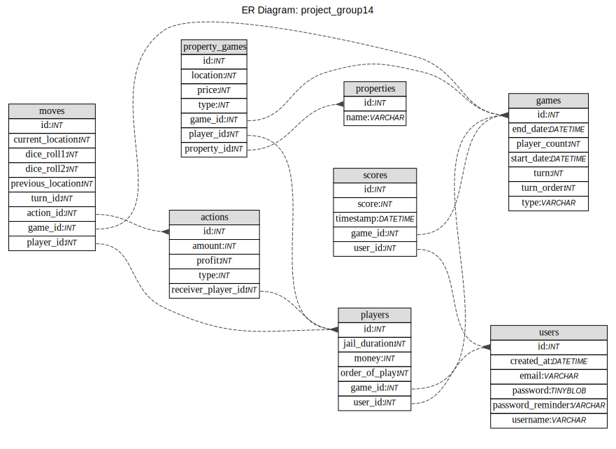

# Ceng453-TermProject-Group14-backend

### Postman

[Invite link](https://app.getpostman.com/join-team?invite_code=90c3a5214bfd863d6f8e15adccac1f62&target_code=0f5b0f8d4b7aa60db61c35c6731eb631)
to the Postman collections.

- If you get 403 from any request, the token might be expired. Please generate a new token by sending a login request,
  and then update collections' bearer tokens using that.

### Swagger Documentations

Swagger documentations are located [here](https://ceng453-term-project-group14.herokuapp.com/swagger-ui/).

### Database Models

### How to run

The project hasn't been deployed to Heroku. Hence, in order to provide a server, we have to run the backend code the first, and then we are able to run the front end code without errors.

That is,
1. Install maven dependencies
2. Open the code in any IDE you would like to use
3. Choose target for the run config
4. Run the backend app
5. Run the frontend app